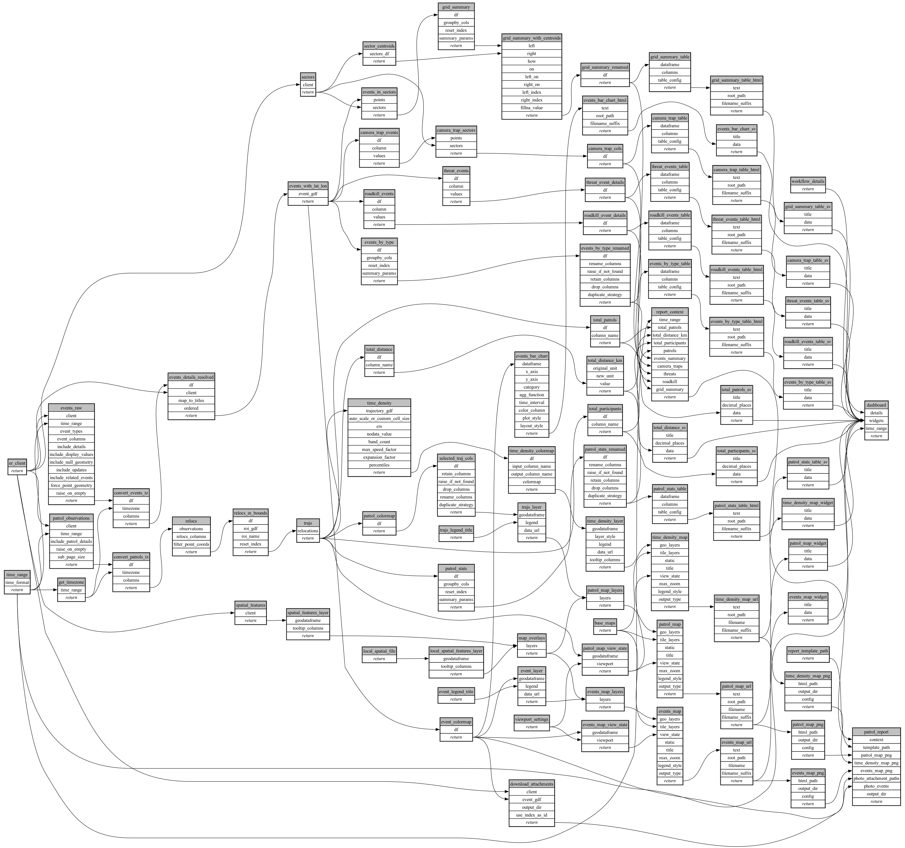

```
# AUTOGENERATED BY ECOSCOPE-WORKFLOWS; see fingerprint in README.md for details

```

```yaml
# fingerprint:
artifacts_sha256_basic: 274d296fbb06860e937d5ad95c79d6655bb9df1ac369c3fd0b25af3c55075f4a
artifacts_sha256_strict: 32d11c6f981c35ecd2f81b2a1b3d2362861ae5213ac993dfa69efd7912798672
installed_requirements:
- channel: https://repo.prefix.dev/ecoscope-workflows/
  name: ecoscope-platform
  version: {version: ==2.22.0}
- channel: https://repo.prefix.dev/ecoscope-workflows-custom/
  name: ecoscope-workflows-ext-custom
  version: {version: ==0.1.0rc24}
- channel: conda-forge
  name: pydeck
  version: {version: ==0.9.2}
- channel: file:///tmp/ecoscope-workflows-custom/release/artifacts/
  name: ecoscope-workflows-ext-icmbio
  version: {version: ==0.0.0}
params_sha256: 2eba8c7b38da8836cc68271310da3229577d129ec6d605cc0654ec5203087154
spec_sha256: a784b92143258a7ea1ccf25a8fc3907c28c0327a259376b4e14f7616a512eced

```

# ecoscope-workflows-patrol-analysis-workflow


