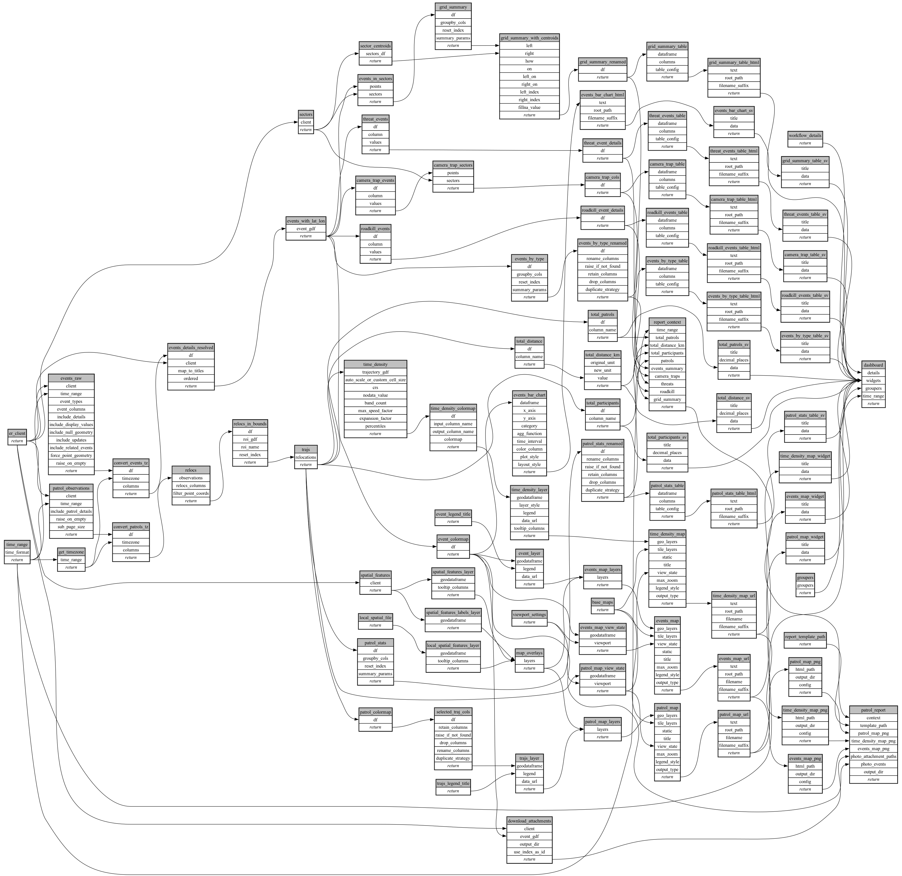

```
# AUTOGENERATED BY ECOSCOPE-WORKFLOWS; see fingerprint in README.md for details

```

```yaml
# fingerprint:
artifacts_sha256_basic: 372bc163b4501aae353cd6729a3b7c32cfdc1476c7afd5fd0534a856c65f3ea9
artifacts_sha256_strict: b51960a4310ba20c548261a6386472a0f9dc684a36794c7209c006d6b3719fd0
installed_requirements:
- channel: https://repo.prefix.dev/ecoscope-workflows/
  name: ecoscope-platform
  version: {version: ==2.25.1}
- channel: file:///tmp/ecoscope-workflows-custom/release/artifacts/
  name: ecoscope-workflows-ext-custom
  version: {version: ==0.1.2.dev4+local}
- channel: conda-forge
  name: pydeck
  version: {version: ==0.9.2}
- channel: file:///tmp/ecoscope-workflows-custom/release/artifacts/
  name: ecoscope-workflows-ext-icmbio
  version: {version: ==0.0.5}
params_sha256: f28289937a3d446c2445951b37337bf3b8c5e8e3e2132ee9a9bcbce77963eb83
spec_sha256: 2fc5cac0f6ebcb96519acb0d9f52f4cf0e94879d81ea1a357abc54e7a6d91c10

```

# ecoscope-workflows-patrol-analysis-workflow


